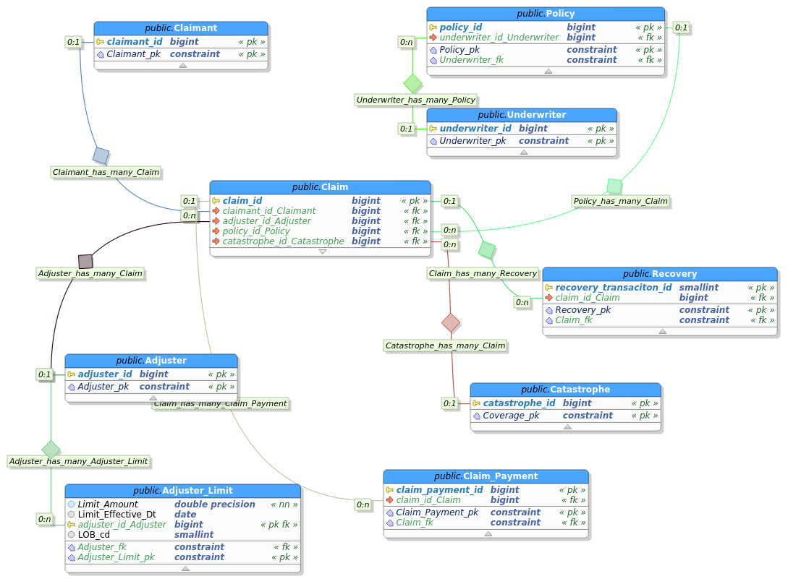

# MIES
[](https://badge.fury.io/py/mies)

Miniature Insurance Economic Simulator



## Introduction

The purpose of MIES is to simulate, with the appropriate balance between detail and abstraction, various economic equilibria that result between the interactions between insurance firms, policyholders, and regulators.

The goal is to create an explanatory model that links economic theory with actuarial science.

## Development Blog
Additional examples can be found in a series of blog posts, here:

https://genedan.com/category/mies/

## Documentation
Documentation can be found here:

https://genedan.com/MIES/docs/

## Concepts Modeled

* [Adverse Selection](https://genedan.com/no-135-mies-simulating-an-insurance-market/)
* Availability of insurance
* Predatory pricing
* Impact of insolvency on insureds

## Project Goals

* Should be consistent with both macro and microeconomic theory
* Should be consistent with actuarial theory

## Installation
```
pip install mies
```

## Example Simulation

```
import pandas as pd
import datetime as dt

from entities.god import God
from entities.broker import Broker
from entities.insurer import Insurer
```

Set up the environment and relative entities - A broker, a population of insureds, and two insurers with 4B in capital:

```
ahura = God()
ahura.make_population(1000)

rayon = Broker()
company_1 = Insurer(4000000, 'company_1')
company_2 = Insurer(4000000, 'company_2')
```

Set up the pricing strategy for each company:

```
company_1_formula = 'incurred_loss ~ age_class + profession + health_status + education_level'
company_2_formula = 'incurred_loss ~ age_class'
```
The broker can now be used to place business, given each insurer's pricing strategy:

```
rayon.place_business(
        pricing_date,
        company_1,
        company_2
)

event_date = pricing_date + dt.timedelta(days=1)
```    

Generate losses, report claims, and then reprice and renew policies:
```
event_date = pricing_date + dt.timedelta(days=1)
ahura.smite(event_date)
rayon.report_claims(event_date)
company_1.price_book(company_1_formula)
company_2.price_book(company_2_formula)
pricing_date = pricing_date.replace(pricing_date.year + 1)
```