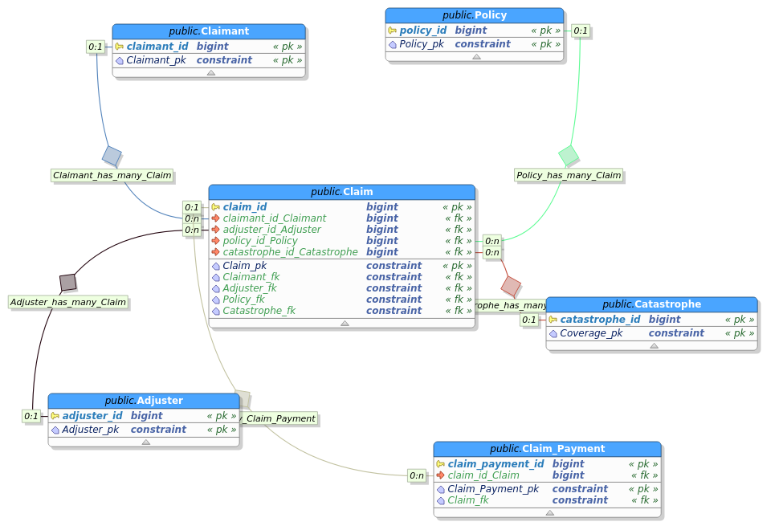

# MIES
Minature Insurance Economic Simulator

## Introduction

The purpose of MIES is to simulate, with the appropriate balance between detail and abstraction, various economic equilibria that result between the interactions between insurance firms, policyholders, and regulators.

The goal is to create an explanatory model that links economic theory with actuarial science.

## Concepts Modeled

* Availability of insurance
* Predatory pricing
* Impact of insolvency on insureds

## Project Goals

* Should be consistent with both macro and microeconomic theory
* Should be consistent with actuarial theory

## Technical Components

* Postgresql as the data store
* Scala to program the simulation
* Intended to be an engine that can be used by web-based applications
